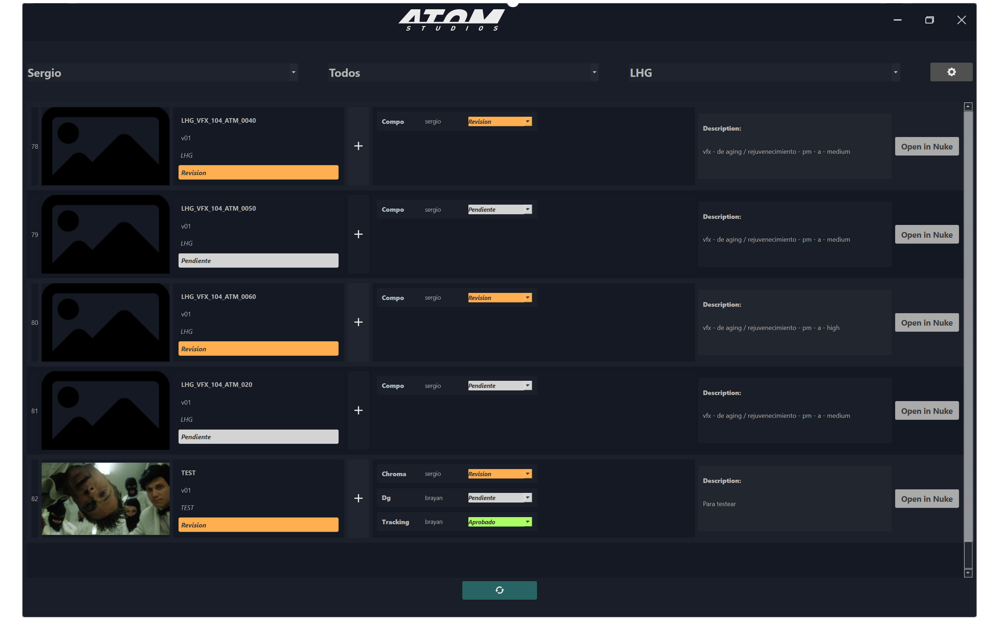

<h1>Shot Control App: Streamlining VFX Workflow</h1>

Simple way to start

    In the fast-paced world of visual effects, managing tasks and maintaining seamless workflows can be challenging. 
    The <strong>Shot Control App</strong> is a cutting-edge desktop application designed to simplify shot management and task tracking. 
    With a modern and intuitive interface, it empowers VFX teams to efficiently manage their projects while leveraging cloud-based infrastructure for unbeatable cost efficiency.

<h2>What is the Shot Control App?</h2>

    The Shot Control App is a robust tool tailored for VFX professionals, providing a centralized hub to manage shots, assign tasks, and monitor their progress. 
    Whether you’re marking tasks as complete or launching the correct Nuke script for a shot, the app is designed to integrate seamlessly into your workflow.

    Built with AWS technologies such as <strong>Lambda</strong>, <strong>DynamoDB</strong>, and <strong>API Gateway</strong>, the backend architecture ensures reliability and scalability while maintaining extremely low operational costs. 
    Additionally, it includes a Nuke panel integration, enabling users to perform essential actions directly within Nuke.

<h2>Features and Benefits</h2>
<ul>
    <li>
        <strong>Task and Shot Management:</strong> Easily assign tasks to specific shots and track their status with a simple and user-friendly interface.
    </li>
    <li>
        <strong>Launch Correct Scripts:</strong> Quickly initiate the corresponding Nuke scripts for each shot, ensuring accuracy and saving time.
    </li>
    <li>
        <strong>Cloud-Powered Backend:</strong> By leveraging AWS services, the app provides exceptional performance with almost zero operational costs, making it a cost-effective solution for any studio.
    </li>
    <li>
        <strong>Nuke Integration:</strong> The built-in Nuke panel eliminates the need to switch between applications. Artists can submit new versions or update task statuses directly from within Nuke.
    </li>
    <li>
        <strong>Modern Design:</strong> The sleek, intuitive interface prioritizes usability, making it accessible to both technical and non-technical team members.
    </li>
</ul>
<h2>How It Works</h2>
<ol>
    <li>Install the desktop application on your system.</li>
    <li>Log in to access your studio's shot database, powered by AWS DynamoDB.</li>
    <li>Assign tasks to individual shots and track their progress in real-time.</li>
    <li>Use the Nuke panel to:
        <ul>
            <li>Send new versions of shots to the system.</li>
            <li>Mark tasks as completed without leaving Nuke.</li>
        </ul>
    </li>
</ol>
<h2>Why Choose the Shot Control App?</h2>

    The Shot Control App is more than just a task manager; it’s a comprehensive solution that bridges the gap between creative work and project management. 
    By integrating directly into Nuke and utilizing the scalability of the cloud, it delivers a powerful yet cost-efficient tool for studios of all sizes.

<h3>Key Advantages:</h3>
<ul>
    <li><strong>Cost-Effectiveness:</strong> A serverless backend ensures minimal operational costs.</li>
    <li><strong>Efficiency:</strong> Streamlined workflows save time and reduce errors.</li>
    <li><strong>Flexibility:</strong> Suitable for both small teams and large studios.</li>
</ul>
<h2>Join the New Era of VFX Workflow</h2>

    As the VFX industry evolves, tools like the Shot Control App redefine how teams collaborate and deliver high-quality work. 
    By combining modern technology with artist-friendly design, this app is paving the way for a more efficient and innovative future in visual effects.

---

<em>Written by Sergio Cespedes.</em>
