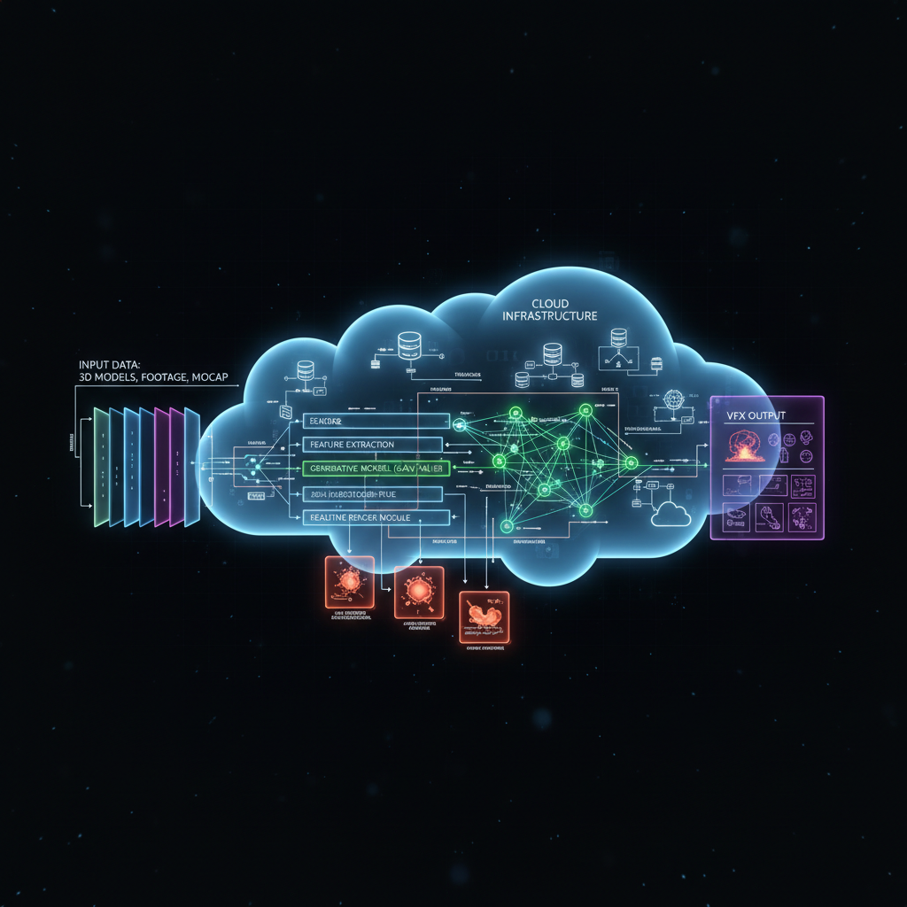

<h1>Ingeniería de un Pipeline img2img para VFX Few-Shot de Alta Fidelidad</h1>

Funciones de Pérdida Híbridas y Orquestación en la Nube

Este artículo prueba pieza a pieza la ingeniería detrás de un pipeline img2img Few-Shot para VFX diseñado para superar las soluciones estándar mediante una busqueda exahuastiva de hipermarametros y arquitecturas.

<h2>1. Calidad SOTA con Recursos Limitados</h2>

<strong>Contexto:</strong> Este proyecto se realizó sin una GPU local, usando unicamente soluciones en la nube de AWS y otros proveedores. El presuopuesto fue de menos de 20 USD

<strong>El Problema:</strong> Las UNETs en la actualidad se mantenido muy parecidas a su lanzamiento en 2016, actulamente tenemos arquitecturas mas modernas como Convexnet, SwinIR o la nueva y prometedora Mamba, la idea es perfeccionar el pipeline actual para entrenar y probar modelos de forma mas rapida y efetiva. Hay areas de mejora como la eficiencia a altas resoluciones y la consistencia temporal con amplio margen de mejora

<strong>Tesis:</strong> La arquitectura no lo es todo, ademas influye mucho la función de pérdida y el pipeline de datos. Ahi esta el 80% del éxito en escenarios de aprendizaje few-shot.

<h2>2. Batalla de Arquitecturas: Nuevo vs. Conocido</h2>

Para encontrar la arquitectura óptima para este pipeline, realicé una comparación rigurosa de varias arquitecturas modernas:

<ul>
    <li><strong>Candidatos:</strong> ConvNeXt, NAFNet, MambaIR (State Space Models), SwinIR.</li>
    <li><strong>El Hallazgo:</strong> Si bien los Transformers y los State Space Models (Mamba) sobresalen en conjuntos de datos a gran escala, sufren de alucinaciones de alta frecuencia y artefactos de "ringing" cuando se entrenan con datos extremadamente limitados (<10 imágenes).</li>
    <li><strong>El Ganador:</strong> La clásica <strong>U-Net</strong>. Sin embargo, no la versión vanilla de 2015. Implementé una U-Net modificada con Attention Gates y, crucialmente, <strong>eliminé el Dropout</strong>.</li>
</ul>

<h3>¿Por Qué Sin Dropout?</h3>

En inferencia, necesitamos <strong>consistencia píxel-determinística absoluta</strong> para mantener la estabilidad temporal. El Dropout introduce varianza estocástica que se percibe como "parpadeo" en secuencias de video. En su lugar, se utilizó Batch Normalization para regularización, asegurando coherencia temporal suave.

<h2>3. El Corazón es la Función de Pérdida Híbrida</h2>

Las funciones de pérdida MSE o L1 estándar a menudo producen resultados borrosos debido a la regresión a la media. Para lograr texturas nítidas de alta fidelidad, diseñé una función de pérdida híbrida personalizada, aqui las posiblidades se disparan se puede usar cualquier modelo de embeddings para comparar los resutlados, por ejemplo para rejuveneciemitos se pueden usar modelos que predigan la edad y usarlos como parte de la funcion de perdida:

    $$L_{total} = \lambda_{1}L_{1} + \lambda_{2}L_{LPIPS} + \lambda_{3}L_{Lap} + \lambda_{4}L_{SSIM}$$

<h3>El Desglose:</h3>
<ul>
    <li><strong>L1 Loss:</strong> Asegura precisión de color global.</li>
    <li><strong>SSIM (Structural Similarity Index):</strong> Preserva la estructura local y la luminancia.</li>
    <li><strong>LPIPS (Perceptual Loss):</strong> La "salsa secreta". Utilizando una red una Alexnet pre-entrenada para "ver" como un humano, recuperando texturas complejas que MSE ignora.</li>
    <li><strong>Laplacian Pyramid Loss:</strong> Fuerza nitidez en bordes y detalles de alta frecuencia, previniendo el aspecto "turbio" común en la restauración neuronal.</li>
</ul>

<h2>4. Ingeniería de Datos: Normalización y "Buen Overfitting"</h2>

<strong>Estrategia de Normalización:</strong> Mientras muchos pipelines usan $[0, 1]$ con Sigmoid, descubrí que <strong>$[-1, 1]$ con Tanh</strong> en la capa de salida converge significativamente mejor para síntesis de imágenes. Centra los gradientes en cero, mitigando el problema del gradiente desvaneciente en capas más profundas.

<h3>La Paradoja del Overfitting</h3>

En Machine Learning clásico, el overfitting es el enemigo. En VFX Few-Shot, <strong>queremos overfitting</strong>. El objetivo es que el modelo memorice la textura exacta del plano específico mientras generaliza posición y movimiento para el resto de los shots, si tenemos una set de entrenamiento representativo el modelo podra generalizar correctamente!

<strong>Implementación:</strong> Esto se logra mediante aumentaciones geométricas y algunas de color para mejorar la estabilidad ante micro cambios color y luz en el plano.

<h2>5. MLOps y Despliegue</h2>

Este pipeline no es solo un experimento de notebook; está construido para escalabilidad en producción.

<ul>
    <li><strong>Seguimiento de Experimentos:</strong> <strong>MLflow</strong> se utiliza para rastrear cada experimento, registrando hiperparámetros y métricas.</li>
    <li><strong>Visualización:</strong> <strong>TensorBoard</strong> Es ideal para monitoreo facil de los entrenamientos, monitorea la convergencia de los componentes de pérdida híbrida, permitiendo el ajuste fino de los pesos $\lambda$.</li>
    <li><strong>Grid Search:</strong> Ajuste automatizado de hiperparámetros para encontrar el balance óptimo entre los términos de pérdida.</li>
    <li><strong>Infraestructura:</strong> El pipeline se puede containerizar y estar listo para despliegue en cloud como <strong>AWS SageMaker</strong>, permitiendo escalado rentable en comparación con mantener estaciones de trabajo locales, podemos desplegar por ejemplos los 5 sets de hipermarametros mas prometedores al mismo tiempo y monitorearlos para tomar decisiones en tiempo real, asi avanzar rapidamente en lugar de esperar dias o semenas los entrenamientos  en una maquina local, las mauiqnas locales deberian ser para trabajar en caliente, no para monitoerar como 15 minutos como va un entrenamiento</li>
</ul>

<h2>Conclusión y Futuro</h2>

Este proyecto demuestra que con ingeniería de precisión y una comprensión profunda de las matemáticas subyacentes, es posible construir un pipeline VFX que rivaliza o supera las soluciones comerciales ya hay varios ejemplos de esto y seguramente se suguiran desarrollando mas soluciones. El código es completamente reproducible y modular.

<strong>Próximos Pasos:</strong> Envolver este pipeline en una API escalable (SaaS) para proporcionar renderizado neuronal de alta fidelidad a estudios sin la necesidad de inversión en infraestructura pesada es el proximo paso de este proyecto.

---

<em>Escrito por Sergio Cespedes.</em>
