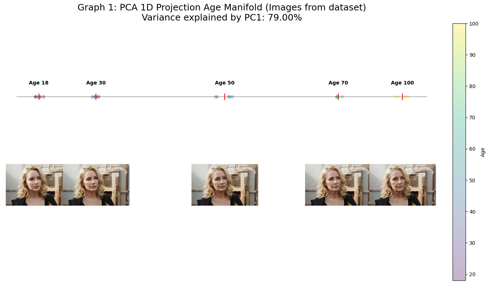
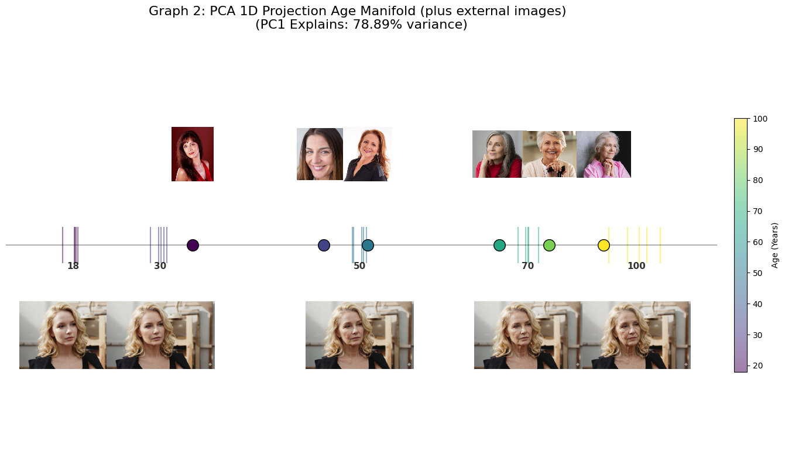
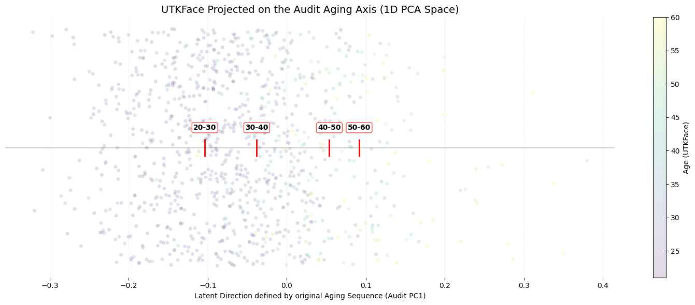

<h1>The Manifold and the Ideology of the Real</h1>

Exploring how DINOv3 maps the geometry of age

    <iframe src="/assets/grafico_pca3d.html" style="width: 100%; height: 100%; border: none;"></iframe>

The most Zizekian concept I've encountered in Deep Learning is, without a doubt, the Manifold.

As Slavoj Zizek would say, the Real is an ungraspable chaos, a pure and traumatic soup of data. However, upon this chaos, we build a series of fictions that structure our reality and give it meaning, we call this ideology. In the world of deep learning, that underlying structure is the Manifold. Although an image lives in a space of thousands of dimensions, its conceptual essence can often be simplified into a few key dimensions. The model's ideology is what allows us to navigate the chaos of pixels with semantic coherence.

<h2>Is Age a Vector in DINOv3?</h2>

To explore the manifold in modern vision models like DINOv3, I created my own dataset with images of the same person at different stages of their life, from age 18 to 100. My goal was to observe how the model represents the concept of age in a face.

In classical Deep Learning, it was often assumed that semantic attributes are linear vectors. However, geometric reality is often more complex and curved, which is why I decided to simplify and use PCA with a single dimension.

<h2>DINOv3, The Age Axis</h2>

When extracting the subject's embeddings and plotting their representations using PCA, the result was revealing.

As seen in <strong>Graph 1</strong>, there is a line that captures the vast majority of the variation in the images. This direction represents purely age, separating identity from temporal change. DINOv3 doesn't just see pixels; it sees the underlying structure of human aging as a navigable dimension.

<h2>Zero-Shot Generalization</h2>

Once this age direction was identified in the curated dataset, I performed a <i>Zero-Shot</i> projection experiment. I projected photos of completely new people, which the model had never seen, onto this conceptual axis.

The result <strong>Graph 2</strong> was an almost perfect alignment. Without training a specific classifier, simply by using simple geometric operations on the Manifold, we achieved a robust approximation of any person's age. The model has universalized the concept.

<h2>4. Validation with UTKFace</h2>

To see how DINOv3 behaves, I subjected the embeddings of the UTKFace dataset, with thousands of diverse faces, to the same 1D logic. When visualizing the results alongside the previous PCA, I found an amazing correlation. Despite the enormous diversity in lighting, pose, and identity, the latent structure of age remained consistent. The fiction of the Manifold is, indeed, stronger than the variety of the Real.

<h2>Beyond the Data</h2>

Just as Zizek invites us to look beyond the obvious to understand the structures that govern us, the Manifold reminds us that Deep Learning works because it discovers and exploits these underlying hierarchies. Understanding the geometry of these spaces is not just theory, it is the key to designing more creative, precise, and above all deep models.

Currently, I am working on a project to inject these types of direction vectors into a generative pipeline, where semantic control is as fluid as ideology itself.

---

<em>Inspired by a discussion on the intersection of philosophy and computer vision.</em>

